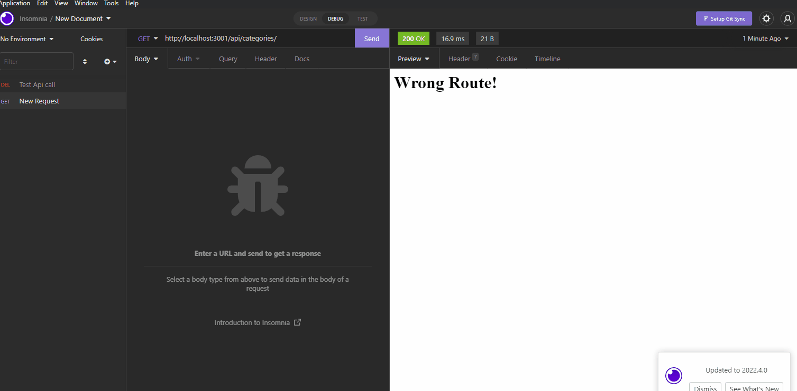
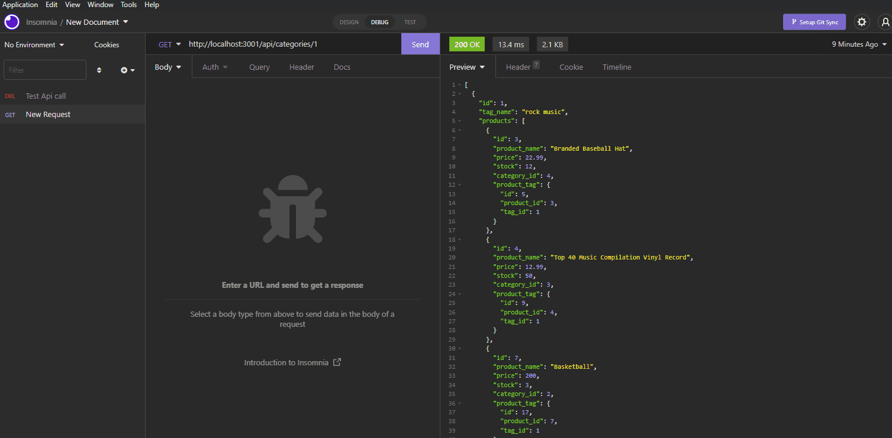
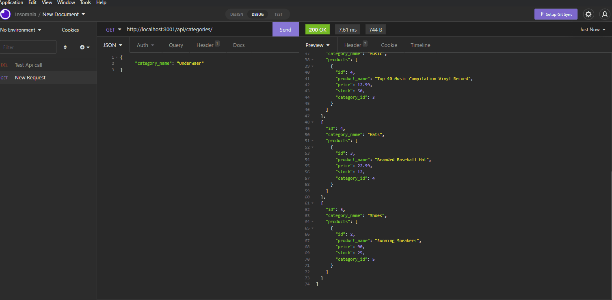

# E-Commerce-Backend

# Live URL 

https://sajjazaidi2015.github.io/E-Commerce-Backend/

# Description

This is an E-commerce backend node.js backend that involves the use of an express.js server and a SQL database. It includes RESTful APIs that has CRUD functionality. It also implemements the usage of sequelize as its ORM tool to convert data to and from the database. Because it is a backend only application, Insomnia was used in order to make requests to the APIs.

# Installation
Please make sure you have node.js installed on your machine! <br>

mysql2 installation: <br>
```shell
npm i mysql2
```
sequelize: <br>
```shell
npm i sequelize
```
express installation: <br>
```shell
npm i express
```
Once you have these things installed, you must have a mysql database running on your system, replace the values for the host, database name, and password to the database in order to connect to your own database.

# Demo

## Demonstrate how to seed the database from the command line.


## Demonstrate GET routes for all categories, all products, and all tags being tested in Insomnia


## Demonstrate GET routes for a single category, a single product, and a single tag being tested in Insomnia



## Demonstrate POST, PUT, and DELETE routes for categories, products, and tags being tested in Insomnia.

